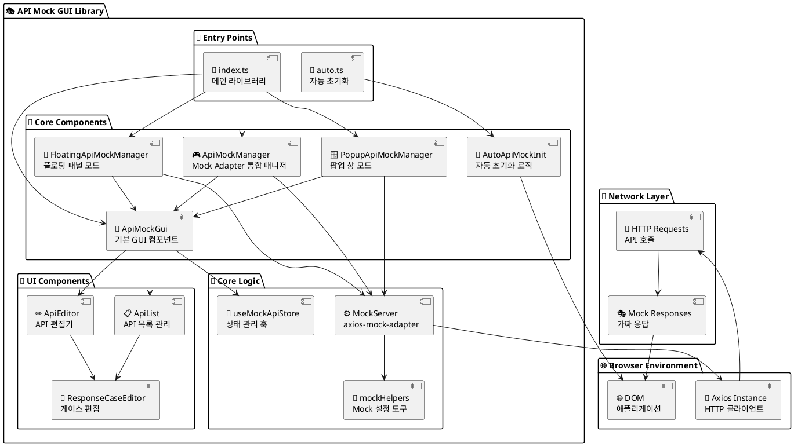
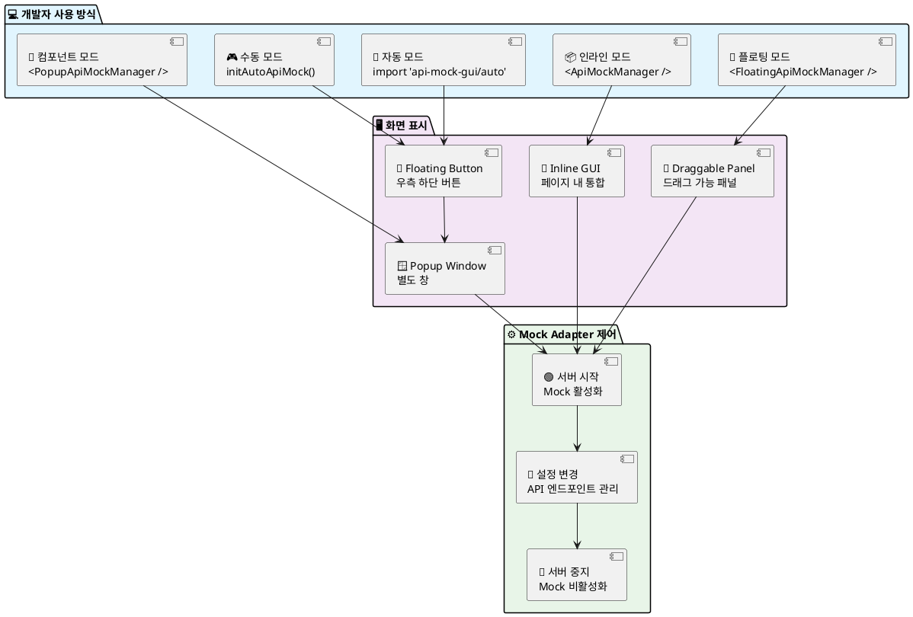
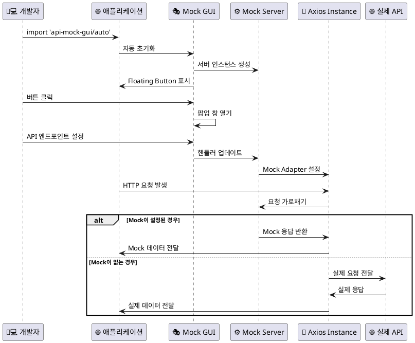

# 🎭 API Mock GUI - 프로젝트 구조 다이어그램

## 📁 전체 프로젝트 구조

```
🎭 API Mock GUI Library Project
├── 📦 api-mock-gui/ (라이브러리)
│   ├── 📂 src/
│   │   ├── 📂 components/
│   │   │   ├── 🧩 ApiMockGui.tsx           # 기본 GUI 컴포넌트
│   │   │   ├── 🧩 ApiList.tsx              # API 목록 관리
│   │   │   ├── 🧩 ApiEditor.tsx            # API 편집기
│   │   │   ├── 🧩 ResponseCaseEditor.tsx   # 응답 케이스 편집
│   │   │   ├── 🎮 ApiMockManager.tsx       # Mock Adapter 통합 매니저
│   │   │   ├── 🎈 FloatingApiMockManager.tsx # 플로팅 버튼 모드
│   │   │   ├── 🪟 PopupApiMockManager.tsx    # 팝업 창 모드
│   │   │   └── 🚀 AutoApiMockInit.tsx       # 자동 초기화
│   │   ├── 📂 hooks/
│   │   │   └── 🎣 useMockApiStore.ts       # 상태 관리 훅
│   │   ├── 📂 mock/
│   │   │   ├── ⚙️ mockServer.ts           # axios-mock-adapter 서버
│   │   │   └── 🔧 setupMsw.ts             # Mock 설정 헬퍼
│   │   ├── 📂 styles/
│   │   │   └── 🎨 globals.css             # Tailwind CSS
│   │   ├── 📂 types/
│   │   │   └── 📝 index.ts                # TypeScript 타입들
│   │   ├── 📄 index.ts                    # 메인 export
│   │   └── 🚀 auto.ts                     # 자동 초기화 entry
│   ├── 📂 dist/ (빌드 결과물)
│   │   ├── 📄 index.js                    # 메인 라이브러리
│   │   ├── 🚀 auto.js                     # 자동 초기화
│   │   ├── 📄 index.d.ts                  # 타입 정의
│   │   └── 🎨 styles.css                  # 컴파일된 CSS
│   ├── 📄 package.json                    # 패키지 설정
│   ├── 📄 tsconfig.json                   # TypeScript 설정
│   └── 📄 README.md                       # 문서
│
└── 🧪 api-mock-test/ (테스트 프로젝트)
    ├── 📂 src/
    │   ├── 📄 App.tsx                     # 테스트 앱
    │   └── 📄 index.tsx                   # 진입점
    ├── 📂 public/
    └── 📄 package.json                    # 테스트 프로젝트 설정
```

## 🏗️ 아키텍처 다이어그램



## 🎮 사용 패턴 다이어그램



## 🔄 데이터 플로우



## 📦 빌드 및 배포 구조


## 🧩 컴포넌트 관계도


## 🌟 주요 특징 요약

| 특징 | 설명 | 구현 컴포넌트 |
|------|------|---------------|
| 🎯 **One-Line Import** | `import 'api-mock-gui/auto'` 한 줄로 활성화 | `auto.ts` + `AutoApiMockInit` |
| 🪟 **팝업 창 모드** | 별도 창에서 GUI 제공, 메인 앱 방해 없음 | `PopupApiMockManager` |
| 🎈 **플로팅 모드** | 드래그 가능한 플로팅 패널 | `FloatingApiMockManager` |
| 📦 **인라인 모드** | 앱 내부에 통합된 GUI | `ApiMockManager` |
| 📡 **axios-mock-adapter 통합** | axios 요청을 직접 가로채어 Mock 응답 제공 | `MockServer` + `mockHelpers` |
| 🔄 **실시간 제어** | 서버 시작/중지 및 설정 변경 | 모든 Manager 컴포넌트 |
| 🎮 **다양한 모드** | 개발 환경에 맞는 유연한 사용법 | 전체 컴포넌트 시스템 |

## 💡 axios-mock-adapter vs MSW 비교

| 측면 | axios-mock-adapter | MSW |
|------|-------------------|-----|
| **설정 복잡도** | 매우 간단 (import만) | 중간 (Service Worker 설정) |
| **지원 범위** | axios 요청만 | 모든 HTTP 요청 |
| **성능** | 매우 빠름 (네트워크 레이어 거치지 않음) | 빠름 (Service Worker 경유) |
| **디버깅** | Console에서만 확인 가능 | Network 탭에서 확인 가능 |
| **호환성** | axios 기반 프로젝트에 최적 | 모든 HTTP 라이브러리 지원 |
| **배포 크기** | 작음 | 중간 |

---

**PlantUML을 사용하여 보다 전문적이고 깔끔한 다이어그램으로 API Mock GUI 라이브러리의 전체 구조와 동작 방식을 시각적으로 보여줍니다. 🎭** 