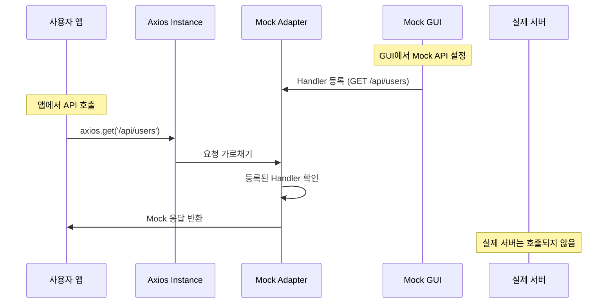

# 🎭 API Mock GUI

[](https://www.npmjs.com/package/api-mock-gui)
[](https://opensource.org/licenses/MIT)
[](http://www.typescriptlang.org/)

**API Mock GUI**는 개발 중인 웹 애플리케이션에서 API 응답을 쉽게 모킹할 수 있는 초간단 라이브러리입니다. 설치만 하면 자동으로 아름다운 floating button이 나타나며, axios-mock-adapter를 기반으로 실제 HTTP 요청을 가로채어 개발자가 정의한 Mock 응답을 제공합니다.

## ✨ 주요 특징

- 🚀 **Zero Config**: 라이브러리 import만으로 즉시 활성화
- 🎯 **자동 Floating Button**: 개발 환경에서 직관적인 데이터베이스 아이콘 버튼 자동 생성
- 📡 **axios-mock-adapter 통합**: axios 요청을 직접 가로채어 Mock 응답 제공 (자동 설치 포함)
- 🔄 **실시간 제어**: Mock 서버 시작/중지 및 API 설정 변경
- 🎨 **향상된 UI/UX**: 모던한 디자인과 부드러운 애니메이션 효과
- 🔧 **개발자 친화적**: TypeScript 지원 및 직관적인 GUI
- 🌐 **포괄적 환경 지원**: 다양한 개발 환경 자동 감지
- 🛠️ **스마트 초기화**: 더 안정적인 자동 초기화 로직

## 🆕 최신 업데이트 (v2.0.2+)

### 🎨 UI/UX 개선
- ✨ **새로운 아이콘**: Database + Zap 아이콘 조합으로 더 직관적인 표현
- 🌈 **모던한 디자인**: 그라디언트 배경과 향상된 그림자 효과
- 💎 **부드러운 애니메이션**: 호버 시 확대/축소 효과와 글로우 애니메이션
- 🏷️ **스마트 툴팁**: 호버 시 상태 정보를 보여주는 인터랙티브 툴팁
- 📏 **더 큰 버튼**: 14x14px로 확대되어 클릭하기 더 쉬움

### 🔧 기능 개선
- 🎯 **향상된 환경 감지**: 더 많은 개발 환경 자동 감지 (Vite, Webpack, DevTools 등)
- 🔧 **강제 활성화**: `localStorage.setItem('apiMockGui.forceEnable', 'true')` 또는 `?dev=true` 파라미터
- 📦 **자동 의존성**: axios-mock-adapter가 자동으로 함께 설치됨
- 💬 **한국어 로그**: 더 친숙한 한국어 콘솔 메시지
- ⚡ **안정성 향상**: 초기화 재시도 로직과 더 나은 에러 핸들링

## 🚀 빠른 시작

### 1. 설치

```bash
npm install api-mock-gui
# axios-mock-adapter도 자동으로 함께 설치됩니다!
```

### 2. 사용하기 (이게 전부입니다!)

```typescript
// App.tsx 또는 index.tsx에 추가
import 'api-mock-gui/auto';

function App() {
  return <div>Your App</div>;
}
```

이것만으로 우측 하단에 아름다운 floating button이 자동으로 나타납니다! 🎉

## 📋 사용 방법

### 🎯 기본 사용법

```typescript
import 'api-mock-gui/auto';
```

**자동으로 발생하는 일들:**
- ✅ 포괄적인 개발 환경 자동 감지 (localhost, Vite, Webpack, DevTools 등)
- ✅ 우측 하단에 모던한 Database 아이콘 floating button 자동 표시
- ✅ 클릭하면 직관적인 Mock API 관리 패널이 열림
- ✅ 프로덕션에서는 자동으로 비활성화 (강제 활성화 옵션 제공)
- ✅ axios-mock-adapter를 통한 HTTP 요청 자동 가로채기
- ✅ 실시간 상태 표시 (실행 중일 때 초록색 펄스 애니메이션)

### 🎮 GUI 사용법

1. **Floating Button 클릭** → 관리 패널 열기 (Database 아이콘)
2. **Mock Server 시작** → "Start" 버튼 클릭 (초록색으로 변경됨)
3. **API 추가** → "Add API" 버튼으로 새 API 생성
4. **API 설정**:
   - Name: API 이름 (예: "Get Users")
   - Method: HTTP 메소드 (GET, POST, PUT, DELETE, PATCH)
   - Path: API 경로 (예: "/api/users")
   - Description: 설명 (선택사항)
5. **자동 응답** → 기본 200 응답이 자동 생성됨
6. **실시간 테스트** → 앱에서 해당 API 호출 시 Mock 응답 받음

### 🔧 개발 환경이 감지되지 않는 경우

다음 방법들을 사용하여 강제로 활성화할 수 있습니다:

```javascript
// 방법 1: localStorage 설정
localStorage.setItem('apiMockGui.forceEnable', 'true');

// 방법 2: URL 파라미터
// http://yourapp.com?dev=true

// 방법 3: 수동 초기화
window.apiMockGuiInit();
```

## 🔧 고급 사용법

### 🎨 커스텀 스타일링

```typescript
// CSS 포함이 필요한 경우
import 'api-mock-gui/dist/styles.css';
```

### 🌐 프레임워크별 가이드

#### Next.js
```typescript
// pages/_app.tsx 또는 app/layout.tsx
import 'api-mock-gui/auto';

export default function App({ Component, pageProps }) {
  return <Component {...pageProps} />;
}
```

#### Vue.js
```javascript
// main.js
import 'api-mock-gui/auto';

const app = createApp(App);
app.mount('#app');
```

#### Vanilla JavaScript
```html
<script type="module">
  import 'api-mock-gui/auto';
</script>
```

## 🔍 실제 동작 방식

### axios-mock-adapter 기반 요청 가로채기



### 내부 동작 과정

1. **Import 시**: 자동으로 floating button 생성
2. **개발 환경 감지**: localhost, 127.0.0.1 등에서만 활성화
3. **axios-mock-adapter 초기화**: axios 인스턴스에 Mock Adapter 적용
4. **GUI 제어**: 실시간으로 Mock API 추가/수정/삭제
5. **자동 Handler 업데이트**: GUI 변경 시 Mock Adapter Handler 자동 갱신

## 📦 라이브러리 구조

```
api-mock-gui/
├── dist/
│   ├── index.js          # 메인 라이브러리 (자동 초기화 포함)
│   ├── index.d.ts        # TypeScript 타입 정의
│   └── styles.css        # Tailwind CSS 스타일
└── 사용자는 이것만 설치하면 됨!
```

## 🔍 디버깅

### 개발자 도구에서 확인

1. **콘솔 로그 확인**:
   ```
   🎭 API Mock GUI Floating Button이 자동으로 생성되었습니다!
   💡 우측 하단의 floating button을 클릭하여 사용하세요.
   ```

2. **Network 탭 확인**:
   - Mock된 요청은 실제 네트워크 요청이 발생하지 않음
   - axios-mock-adapter가 요청을 가로채어 즉시 응답

3. **Floating Button 확인**:
   - 우측 하단에 작은 둥근 버튼 (Settings 아이콘)
   - Server 실행 중일 때 초록색 dot 표시

### 일반적인 문제 해결

**Q: Floating button이 나타나지 않아요**
```javascript
// 환경 확인
console.log('Hostname:', window.location.hostname);

// 개발 환경인지 확인
const isDev = window.location.hostname.includes('localhost') || 
              window.location.hostname.includes('127.0.0.1');
console.log('Is Development:', isDev);
```

**Q: axios가 Mock되지 않아요**
1. axios를 사용하고 있는지 확인 (fetch API는 지원하지 않음)
2. Mock Server가 "Running" 상태인지 확인
3. API Path가 정확히 일치하는지 확인
4. HTTP Method가 일치하는지 확인

**Q: fetch API를 사용하고 있어요**
```typescript
// fetch 대신 axios 사용을 권장합니다
// Before
const response = await fetch('/api/users');

// After
import axios from 'axios';
const response = await axios.get('/api/users');
```

## 📄 라이선스

MIT License - 자세한 내용은 [LICENSE](LICENSE) 파일을 참조하세요.

## 🙋‍♂️ 지원

- **Issues**: [GitHub Issues](https://github.com/Quiet-Frontiers/apiMockGui/issues)

---

**Made with ❤️ for developers who love efficient API mocking**
 