# 🎭 API Mock GUI

[](https://www.npmjs.com/package/api-mock-gui)
[](https://opensource.org/licenses/MIT)
[](http://www.typescriptlang.org/)

**API Mock GUI**는 개발 중인 웹 애플리케이션에서 API 응답을 쉽게 모킹할 수 있는 초간단 라이브러리입니다. 설치만 하면 자동으로 작은 floating button이 나타나며, MSW(Mock Service Worker)를 기반으로 실제 HTTP 요청을 가로채어 개발자가 정의한 Mock 응답을 제공합니다.

## ✨ 주요 특징

- 🚀 **Zero Config**: 라이브러리 import만으로 즉시 활성화
- 🎯 **자동 Floating Button**: 개발 환경에서 작고 둥근 버튼이 우측 하단에 자동 생성
- 📡 **MSW 통합**: Service Worker를 통한 실제 네트워크 요청 차단
- 🔄 **실시간 제어**: Mock 서버 시작/중지 및 API 설정 변경
- 🔧 **개발자 친화적**: TypeScript 지원 및 직관적인 GUI
- 🌐 **프레임워크 무관**: React, Next.js, Vue.js 등 다양한 환경 지원

## 🚀 빠른 시작

### 1. 설치

```bash
npm install api-mock-gui
```

### 2. MSW 서비스 워커 설정

```bash
npx msw init public/ --save
```

### 3. 사용하기 (이게 전부입니다!)

```typescript
// App.tsx 또는 index.tsx에 추가
import 'api-mock-gui';

function App() {
  return <div>Your App</div>;
}
```

이것만으로 우측 하단에 작은 floating button이 자동으로 나타납니다! 🎉

## 📋 사용 방법

### 🎯 기본 사용법

```typescript
import 'api-mock-gui';
```

**자동으로 발생하는 일들:**
- ✅ 개발 환경(localhost, 127.0.0.1 등) 자동 감지
- ✅ 우측 하단에 작고 둥근 floating button 자동 표시
- ✅ 클릭하면 Mock API 관리 패널이 열림
- ✅ 프로덕션에서는 자동으로 비활성화
- ✅ MSW를 통한 HTTP 요청 자동 가로채기

### 🎮 GUI 사용법

1. **Floating Button 클릭** → 관리 패널 열기
2. **Mock Server 시작** → "Start" 버튼 클릭
3. **API 추가** → "Add API" 버튼으로 새 API 생성
4. **API 설정**:
   - Name: API 이름 (예: "Get Users")
   - Method: HTTP 메소드 (GET, POST, PUT, DELETE, PATCH)
   - Path: API 경로 (예: "/api/users")
   - Description: 설명 (선택사항)
5. **자동 응답** → 기본 200 응답이 자동 생성됨
6. **실시간 테스트** → 앱에서 해당 API 호출 시 Mock 응답 받음

### 🧪 실제 사용 예시

```typescript
// 1. 라이브러리 import
import 'api-mock-gui';

function MyApp() {
  const [users, setUsers] = useState([]);

  // 2. 실제 API 호출 (Mock으로 가로채짐)
  const fetchUsers = async () => {
    const response = await fetch('/api/users');
    const data = await response.json();
    setUsers(data.users || []);
  };

  return (
    <div>
      <button onClick={fetchUsers}>Load Users</button>
      {/* Floating button이 자동으로 우측 하단에 나타남 */}
    </div>
  );
}
```

### 🎛️ 수동 제어 (선택사항)

브라우저 콘솔에서 직접 제어할 수 있습니다:

```javascript
// 완전히 제거
window.cleanupApiMockGui();
```

## 🔧 고급 사용법

### 🎨 커스텀 스타일링

```typescript
// CSS 포함이 필요한 경우
import 'api-mock-gui/dist/styles.css';
```

### 🌐 프레임워크별 가이드

#### Next.js
```typescript
// pages/_app.tsx 또는 app/layout.tsx
import 'api-mock-gui';

export default function App({ Component, pageProps }) {
  return <Component {...pageProps} />;
}
```

#### Vue.js
```javascript
// main.js
import 'api-mock-gui';

const app = createApp(App);
app.mount('#app');
```

#### Vanilla JavaScript
```html
<script type="module">
  import 'api-mock-gui';
</script>
```

## 🔍 실제 동작 방식

### MSW 기반 요청 가로채기

```mermaid
sequenceDiagram
    participant App as 사용자 앱
    participant MSW as MSW Worker
    participant GUI as Mock GUI
    participant Server as 실제 서버

    Note over GUI: GUI에서 Mock API 설정
    GUI->>MSW: Handler 등록 (GET /api/users)
    
    Note over App: 앱에서 API 호출
    App->>MSW: fetch('/api/users')
    MSW->>MSW: 등록된 Handler 확인
    MSW->>App: Mock 응답 반환
    
    Note over Server: 실제 서버는 호출되지 않음
```



### 내부 동작 과정

1. **Import 시**: 자동으로 floating button 생성
2. **개발 환경 감지**: localhost, 127.0.0.1 등에서만 활성화
3. **MSW 초기화**: Service Worker를 통한 요청 가로채기 준비
4. **GUI 제어**: 실시간으로 Mock API 추가/수정/삭제
5. **자동 Handler 업데이트**: GUI 변경 시 MSW Handler 자동 갱신

## 📦 라이브러리 구조

```
api-mock-gui/
├── dist/
│   ├── index.js          # 메인 라이브러리 (자동 초기화 포함)
│   ├── index.d.ts        # TypeScript 타입 정의
│   └── styles.css        # Tailwind CSS 스타일
└── 사용자는 이것만 설치하면 됨!
```

## 🔍 디버깅

### 개발자 도구에서 확인

1. **콘솔 로그 확인**:
   ```
   🎭 API Mock GUI Floating Button이 자동으로 생성되었습니다!
   💡 우측 하단의 floating button을 클릭하여 사용하세요.
   ```

2. **Network 탭 확인**:
   - Mock된 요청은 `(from service worker)` 표시
   - 실제 네트워크 요청 대신 로컬 응답

3. **Floating Button 확인**:
   - 우측 하단에 작은 둥근 버튼 (Settings 아이콘)
   - Server 실행 중일 때 초록색 dot 표시

### 일반적인 문제 해결

**Q: Floating button이 나타나지 않아요**
```javascript
// 환경 확인
console.log('Hostname:', window.location.hostname);

// 개발 환경인지 확인
const isDev = window.location.hostname.includes('localhost') || 
              window.location.hostname.includes('127.0.0.1');
console.log('Is Development:', isDev);
```

**Q: MSW가 작동하지 않아요**
1. `npx msw init public/ --save` 실행 확인
2. `public/mockServiceWorker.js` 파일 존재 확인
3. HTTPS 환경에서만 Service Worker 작동 (localhost 제외)

**Q: API 요청이 Mock되지 않아요**
1. Mock Server가 "Running" 상태인지 확인
2. API Path가 정확히 일치하는지 확인
3. HTTP Method가 일치하는지 확인

## 📄 라이선스

MIT License - 자세한 내용은 [LICENSE](LICENSE) 파일을 참조하세요.

## 🙋‍♂️ 지원

- **Issues**: [GitHub Issues](https://github.com/Quiet-Frontiers/apiMockGui/issues)

---

**Made with ❤️ for developers who love efficient API mocking**
 